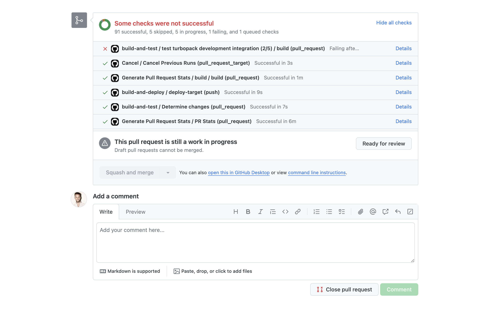

# GitHub Checks Sorter

A Chrome extension to sort GitHub checks by status.

Shows failed GitHub checks at the top of the list.

This extension has no UI and no settings. It only sorts the list of status checks on the pull request details page.

## Installation

1. Download [this zip](https://github.com/dferber90/github-checks-sorter/archive/refs/heads/main.zip)
2. Extract it to a folder
3. Open [chrome://extensions](chrome://extensions)
4. Enter developer mode
5. Click "Load unpacked"
6. Select the folder you extracted the zip to

## Privacy Policy

This extension does not collect any data at all.
